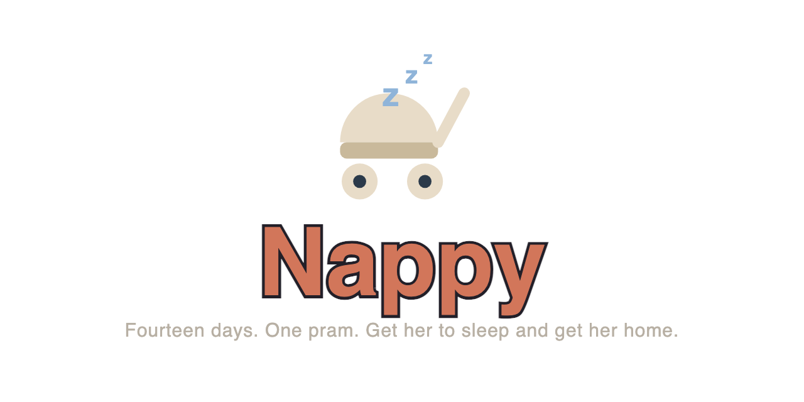

<p align="center">
  <a href="https://nappy.josuakrause.com/">
	
  </a>
</p>

A 2.5D top-down game about a mother pushing a stroller through a city, trying to get her
baby to sleep. **[Play it in a browser.](https://nappy.josuakrause.com/)**

- **Engine:** Godot 4.7
- **Genre:** Roguelike / route-planning
- **Core loop:** Walk a route → keep the baby calm → fill the sleepiness meter → return home.

The city is fixed for a whole run, so the map is knowledge you earn and keep. The noise in
it is not.

> **Spoilers:** everything under `docs/` describes the game's full arc, including things a
> player should meet for the first time in play. This README deliberately does not.

## Documentation

| Doc | Contents |
| --- | --- |
| [CLAUDE.md](CLAUDE.md) | How to work on this repo — an index; the rules are in `.claude/skills/`. Codex reads it too, through `.codex/config.toml` |
| [docs/HANDOFF.md](docs/HANDOFF.md) | Where to pick up: the state of the tree and what is queued |
| [docs/DECISIONS.md](docs/DECISIONS.md) | The history — decisions taken, options rejected, what changed and why |
| [docs/DESIGN.md](docs/DESIGN.md) | Pillars, core loop, win/lose conditions |
| [docs/MECHANICS.md](docs/MECHANICS.md) | Meters, movement, tuning constants |
| [docs/CITY.md](docs/CITY.md) | City generation, tile types, calm zones |
| [docs/EVENTS.md](docs/EVENTS.md) | Event catalogue, telegraphing, scheduling |
| [docs/GRAPHICS.md](docs/GRAPHICS.md) | Graphics assets, current runtime uses and prepared milestone parts |
| [docs/NARRATIVE.md](docs/NARRATIVE.md) | Act structure, side content, endings — **spoilers** |
| [docs/ARCHITECTURE.md](docs/ARCHITECTURE.md) | Code layout, autoloads, signals |
| [docs/TELEMETRY.md](docs/TELEMETRY.md) | What a run writes down, and how to read it |
| [docs/TODO.md](docs/TODO.md) | The queue: open work only |
| `docs/playtests/PLAYTEST-NN.md` | One per playtest, a player's own words on a date. Primary sources, never rewritten |

## Running

```sh
./tools/run.sh                     # play
./tools/run.sh --seed 12345        # a specific city
./tools/run.sh --day 9 --overview  # look at a later act from above
```

`godot` is not on `PATH` on macOS — the binary lives inside the app bundle, so
`tools/run.sh` finds it for you. Override with `GODOT=/path/to/Godot tools/run.sh`.
Or open the project folder in Godot 4.7 directly.

## Controls

| Input | Action |
| --- | --- |
| Arrow keys / WASD | Walk |
| Hold Shift | Run (raises excitement) |
| Space | Begin, on the title screen; continue, on the between-days screen and from the pause |
| Esc | Pause, and carry on again |
| R | Start the run again — from the pause screen |
| Q | Quit — from the title or the pause screen |
| P (or F9) | Write a screenshot and a line of trace into the telemetry folder. A debug key, not a game feature — see `docs/TELEMETRY.md` |
| B | Capture a three-second animation burst targeting 12 fps into the telemetry folder (debug only) |

The game opens on a title screen with the street outside your own front door running behind
it, and a finished run goes back to it.

## Dev flags

Everything after `--` is passed to the game, gated behind a debug build so none of it does
anything in an exported release:

```sh
godot --path . -- --seed 12345 --day 9 --overview
```

`tools/run.sh` and `tools/shot.sh` forward whatever you give them the same way, validated first
against the shapes below before either ever launches Godot — an unknown flag or one missing its
value is rejected on the spot. That accept-list is not a copy of this table: it lives in
`src/dev/dev_flags.gd`'s own `DEV_FLAG_TABLE`, which both scripts read live, and `tools/run.sh
--help` / `tools/shot.sh --help` print it back out, so the shell side cannot drift from what the
game actually reads. This table is the semantics — what each flag *means* — and
`tools/test_cli_help.sh` (run in CI) asserts that every flag name in `DEV_FLAG_TABLE` still
appears somewhere below, so an entry added to one and not the other fails the build rather than
going quietly stale.

| Flag | Effect |
| --- | --- |
| `--seed N` | Regenerate a specific city |
| `--day N` | Start on a later day, to look at a later act |
| `--day-length N` | Compress the day, for dusk and the timeout loss |
| `--meters S E` | Seed the two meters, to screenshot a UI state |
| `--spawn park\|alley\|square\|playground` | Drop the player on a tile type |
| `--spawn event[:id]` | Drop the player beside a live event |
| `--spawn arterial\|zone[:n]\|signal\|landmark\|closure[:n]\|edge[:s\|e\|w]\|corner[:nw\|ne\|sw\|se]` | Drop her at one of the places worth photographing: the busiest pavement, a multi-block calm zone (`zone:1` for the second one, which is where a 2×1 will be), a signalled junction on the spine, a big building, a closed street seen from its junction, one of the ways out of the map, or a corner of it where two bands of the border meet |
| `--follow <event id>` | Park a camera on an event wherever it goes |
| `--force <event id> [seconds]` | Hand out **only** that row, over and over, every `seconds` (default 6) of walking — for looking at one encounter rather than one city. Bypasses `first_day` and the day's budget; `--seed` and `--day` still decide everything around it |
| `--overview` | Frame the whole city at once |
| `--screenshot out.png --after N` | Render for N **seconds**, save a PNG, quit |
| `--walk north\|south\|east\|west\|<script>` | Hold a direction down for the whole run, or walk a script of timed steps — `1s5e` is one second south then five east, and `3@45@2e` is three seconds at a bearing of 45° then two east. A bearing is degrees clockwise from north, delimited by a pair of `@`s so its digits do not run into the next step's |
| `--flee [delay]` | Turn round and run when something starts chasing her, after dithering for `delay` seconds |
| `--press <action\|key:name> <seconds>` | Tap an action or a bare key, so a rig can press one. May be given more than once — `--press pause 2 --press key:r 3.5` |
| `--tap X Y` | Send one synthetic touch at the raw screen position (X, Y), the moment the run starts |
| `--touch` | Force the touch control scheme, for a desktop screenshot of it |
| `--controls joystick\|tap` | Force a control scheme, the command-line half of the page's own `?controls=` |
| `--layers 1,3` | Set which of the three debug geometry layers start on, for a reproducible rig screenshot |
| `--svg` | Force SVG presentation over PNG, even where a matching PNG asset exists (also reachable as a release web build's own `?svg=1`) |
| `--start-escape [stairwell:left\|stairwell:right\|lobby\|basement\|floor:N]` | Start straight in the escape scene's interior instead of the title and the city, optionally at one of its seven parts |
| `--title` | Open on the title screen even under a screenshot rig, which otherwise skips it |
| `--no-title` | Skip the title screen |
| `--ending bad\|neutral\|good` | Put the given ending screen up at boot, to screenshot one without playing a run out to reach it |
| `--no-telemetry` | Do not write a run log |
| `--web` | Preview the web export's hidden-quit shape (`QuitOption`) from a desktop debug build |

## Run logs

Every run writes a plain-text trace of what happened, in order — what was shut, where the
player went, what came near, how the day ended. `./tools/telemetry.sh` prints the newest one
(`-f` follows a run in progress, `-l` lists them). [docs/TELEMETRY.md](docs/TELEMETRY.md)
says what the entries mean.

For animation feedback, press **B** during desktop debug gameplay. The burst saves numbered
PNGs and frame timestamps in a separate `asked/burst-<id>/` folder. Run `./tools/clip.sh` to
scan the telemetry folder and convert every finished burst missing its sibling MP4, or
`./tools/clip.sh "path/to/burst-folder"` to
choose one. The MP4 sits beside that folder and all original frames remain available. P still
takes a single screenshot.

## Verifying a build

`.godot/` is gitignored, so a fresh clone needs an import pass before `class_name` types
resolve. `tools/check.sh` does the import and then boots the project headless, failing on
any script error; `tools/test.sh` is the headless suite, and it is what a commit rests on.

```sh
./tools/check.sh
./tools/test.sh                 # everything
./tools/test.sh crowd events    # just those suites, for the inner loop
./tools/lint.sh                 # the docs, for sentences that go stale on their own
./tools/pycheck.sh              # the Python under tools/: ruff, mypy, its unit tests (needs uv)
```

A filtered run prints `PARTIAL RUN` under its count and is deliberately not a green build.

## License

The **code** — `src/`, `tests/`, `tools/`, the project configuration — is [MIT](LICENSE). The
**game** — the art under `assets/`, the documents under `docs/`, the title, the narrative and its
characters — is [Creative Commons Attribution-NonCommercial-NoDerivatives 4.0 International (CC
BY-NC-ND 4.0)](LICENSE-ASSETS): read it, share it unmodified with credit, do not sell it, do not
publish a changed version. Build with the code freely; do not re-publish the game. See
[LICENSE.md](LICENSE.md) for how the two licenses fit together in plain language.
