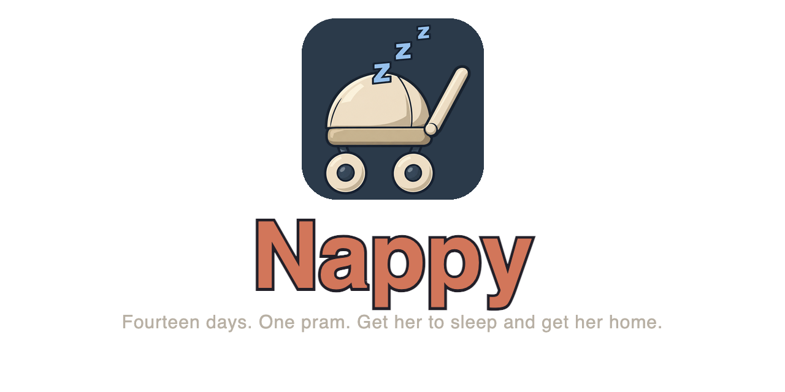

<p align="center">
  <a href="https://nappy.josuakrause.com/">
	
  </a>
</p>

A 2.5D top-down game about a mother pushing a stroller through a city, trying to get her
baby to sleep. **[Play it in a browser.](https://nappy.josuakrause.com/)**

- **Engine:** Godot 4.7
- **Genre:** Roguelike / route-planning
- **Core loop:** Walk a route → keep the baby calm → fill the sleepiness meter → return home.

The city is fixed for a whole run, so the map is knowledge you earn and keep. The noise in
it is not.

[Watch the gameplay trailer on YouTube.](https://youtu.be/88nfOmjEcHc)

<p align="center">
  <a href="https://youtu.be/88nfOmjEcHc">
	
  </a>
</p>

> **Spoilers:** everything under `docs/` describes the game's full arc, including things a
> player should meet for the first time in play. This README deliberately does not.

## Documentation

| Doc | Contents |
| --- | --- |
| [CLAUDE.md](CLAUDE.md) | How to work on this repo — an index; the rules are in `.claude/skills/`. Codex reads it too, through `.codex/config.toml` |
| [docs/DECISIONS.md](docs/DECISIONS.md) | Where the history is — one file per decision under `docs/decisions/`, found with `tools/decisions.sh` |
| [docs/DESIGN.md](docs/DESIGN.md) | Pillars, core loop, win/lose conditions |
| [docs/MECHANICS.md](docs/MECHANICS.md) | Meters, movement, tuning constants |
| [docs/CITY.md](docs/CITY.md) | City generation, tile types, calm zones |
| [docs/EVENTS.md](docs/EVENTS.md) | Event catalogue, telegraphing, scheduling |
| [docs/GRAPHICS.md](docs/GRAPHICS.md) | Graphics assets, current runtime uses and prepared milestone parts |
| [docs/NARRATIVE.md](docs/NARRATIVE.md) | Act structure, side content, endings — **spoilers** |
| [docs/ARCHITECTURE.md](docs/ARCHITECTURE.md) | Code layout, autoloads, signals |
| [docs/TELEMETRY.md](docs/TELEMETRY.md) | What a run writes down, and how to read it |
| [docs/TODO.md](docs/TODO.md) | The queue: open work only; each entry is a folder under `docs/todo/` whose `README.md` opens with its priority band, each item a file, and `tools/queue.sh` prints the order |
| [docs/REVIEW.md](docs/REVIEW.md) | What waits on a person; each thing to try is a file under `docs/review/` |
| `docs/playtests/` | One file per playtest, a player's own words on a date. Primary sources, never rewritten |

## Running

```sh
./tools/run.sh                     # play
./tools/run.sh --seed 12345        # a specific city
./tools/run.sh --day 9 --overview  # look at a later act from above
```

`godot` is not on `PATH` on macOS — the binary lives inside the app bundle, so
`tools/run.sh` finds it for you. Override with `GODOT=/path/to/Godot tools/run.sh`.
Or open the project folder in Godot 4.7 directly.

## Controls

| Input | Action |
| --- | --- |
| Arrow keys / WASD | Walk |
| Hold Shift | Run (raises excitement) |
| Space | Begin, on the title screen; continue, on the between-days screen and from the pause |
| Esc | Pause, and carry on again |
| R | Start the run again — from the pause screen |
| Q | Quit — from the title or the pause screen |
| P (or F9) | Write a screenshot and a line of trace into the telemetry folder. A debug key, not a game feature — see `docs/TELEMETRY.md` |
| B | Capture a three-second animation burst targeting 12 fps into the telemetry folder (debug only) |

The game also pauses itself, the same way Esc does, the moment the window loses focus — Alt-Tabbing
away, a browser tab going to the background, or a phone sending the app away — and getting focus
back does not carry on for you; press continue when you are back. See `--no-focus-pause` below for
the override a rig needs.

The game opens on a title screen with the street outside your own front door running behind
it, and a finished run goes back to it. With a save on disk, pressing start brings up the day
brief instead of starting the day outright.

## Saving

The run is saved automatically — when a day starts being played, and when the day brief or the
end-of-day message comes up — so closing the game and opening it again picks the run back up at
the title, ready to continue rather than losing anything. There is no save button, no slot and no
menu; a small symbol in the corner marks each write. A game closed in the middle of a day comes
back at that day's dawn and costs a nerve, the same as losing the day outright; a game closed
between days, or at the day brief before continuing past it, comes back at the same screen for
free. Holding restart, on the pause screen or the day summary, clears the save and starts over.
See `docs/MECHANICS.md`, "Saving and resuming".

## Dev flags

`tools/trailer.sh` records the saved scenes referenced by `tools/trailer/shots.json` through the
game's frame-locked movie writer, then adds the shot list's dark editorial cards, tracked logo, captions over the footage, ending copy
and deterministic oscillator score before joining them with the captured game audio. Run
`tools/trailer.sh --list` to inspect the cut, `--validate` to check its recipes headlessly,
`--shot choice` to record one scene, or `--auditions` to capture one clean game-audio base and
build the three original scores in `tools/trailer/scores.json` against that same picture. A later
score-only audition run reuses the matching retained base. To build the selected full composition
from a fresh checkout, run `TRAILER_OUT=build/trailer/fresh tools/trailer.sh --selected`.
It captures the tracked scenes, builds Glass Alarm with additive event bass from
`tools/trailer/final-score.json`, and lets the score's final note decay without an added closing
layer. It records fresh capture and editorial provenance. No historical
movie or ignored build artifact is required. The selected score's synthesized PCM sample hash is
checked before normalization; its target level and peak ceiling are checked after normalization.
Host-specific gain rounding and WAV encoder tags may differ. The unflagged command retains the
shot list's draft score.
When compatible historical footage is available, `--selected-reuse` refuses any retained-base mismatch,
renders the hook, dog and title replacements named by that final composition, and layers its
additive event cues over the source-identical selected score. `--selected-remix` reuses the
verified selected base and rebuilds only the editorial cards and audio, with no gameplay capture.
Selected outputs refuse an existing movie or manifest; use a new output name or fresh output
directory for another review. The completed PCM mix stays beside its source stems for comparison
with decoded delivery audio. The opening background starts immediately, the mother independently
fades in across the full 4.4-second intro, and the main title has no fades. Gameplay scenes fade
both out and in through black, including the final shot's fade-out. The auditions' local `index.html` switches one
player between the choices and can jump to the military turn. The cut uses the selected westward birds scene,
`trailer-birds.json`, and the park-only circular walk in `trailer-park-circle.json`.
Each recipe owns its setup and scripted action;
the shot list owns the cut timing and editorial treatment. Only normal scenes enter the trailer,
with their authored extent and validation scope preserved in the resolved manifest. The editor
reads the native viewport size from `project.godot`, resolves the named font through fontconfig
(a font that resolves to a different family stops the render with an error, never a substitute;
`--validate` renders nothing and needs neither ffmpeg nor a font), and records the exact font, ffmpeg, source hashes and dimensions in
`build/trailer/editorial-settings.json` beside the local video.

`tools/record.sh --recipe scene-recipes/trailer-choice.json` records a recipe in scripted mode.
It also records ordinary rigs, such as `tools/record.sh --route calm,home --seed 4242`.
Videos and temporary frames stay under ignored build output. A render is the same every time
by construction: fixed recipes and seeds, the recipe's own simulation clock, the movie writer's fixed
frame rate, and an editor whose inputs (font, ffmpeg, shot list) are recorded. Recordings retain compact frame
hashes, manifests and settings beside the video. `tools/trailer.sh --check all` compares two
renders of each gameplay shot, including their simulation observations and audio, compares the
editorial cards, then composes both retained passes and compares the decoded ending overlays,
score and final mix; `--check-load all` makes the second pass under a CPU load worker. Results
remain under `build/trailer/checks/`. Matching frames establish repeatability for the recorded
recipe, revision, assets, engine, editor and settings.

Everything after `--` is passed to the game, gated behind a debug build so none of it does
anything in an exported release:

```sh
godot --path . -- --seed 12345 --day 9 --overview
```

`tools/run.sh` and `tools/shot.sh` forward whatever you give them the same way, validated first
against the shapes below before either ever launches Godot — an unknown flag or one missing its
value is rejected on the spot. That accept-list is not a copy of this table: it lives in
`src/dev/dev_flags.gd`'s own `DEV_FLAG_TABLE`, which both scripts read live, and `tools/run.sh
--help` / `tools/shot.sh --help` print it back out, so the shell side cannot drift from what the
game actually reads. This table is the semantics — what each flag *means* — and
`tools/test_cli_help.sh` (run in CI) asserts that every flag name in `DEV_FLAG_TABLE` still
appears somewhere below, so an entry added to one and not the other fails the build rather than
going quietly stale.

### A rig's window and its wall-clock limit

A run carrying `--screenshot`, `--walk`, `--flee`, `--press`, `--tap` or `--route` — a rig, rather
than a person at the keyboard — gets four things neither a flagless `tools/run.sh` session nor one
carrying only flags like `--seed`/`--day` gets:

- **Its window never takes the OS focus**, so it never interrupts whatever else is on screen.
- **It hears no real key or pointer press** — only the script driving it can move her or open a
  screen — so a stray press into the wrong window can never reach it.
- **It always closes.** The game quits itself once its own script's length (an `--after` value, or
  the day's own length when nothing bounds it more tightly) plus a margin passes, capped at a fixed
  ceiling regardless; `tools/shot.sh`, and `tools/run.sh` when a rig flag is present, additionally
  kill the process from outside if it is somehow still alive a further grace period past that —
  loudly, on stderr, with a non-zero exit. The three numbers (`src/dev/dev_flags.gd`'s own
  `RIG_QUIT_SECONDS`): a 15s margin, a 240s ceiling, and a 15s kill grace on top.
- **On macOS it hands focus straight back.** The window flag above keeps keys out, but macOS still
  makes Godot itself the active app once its own startup calls `activateIgnoringOtherApps:`, which
  nothing launch-side can gate. `tools/shot.sh` and a rig-flagged `tools/run.sh` note whichever app
  was frontmost right before Godot launches and, for as long as the rig runs, a background watcher
  reactivates that app the instant Godot becomes frontmost — so a capture costs a flicker rather
  than the player's own focus. Only a switch *to* this rig's own Godot is undone: moving to a third
  app on purpose is left alone. See `tools/lib_dev_flags.sh`'s own `rig_focus_note` and
  `rig_focus_watch_start` for the mechanism.

`--route` cannot be combined with `--screenshot`: `RouteRig` quits the process itself the moment she
arrives, which can beat `--after`'s own timer, so the combination is refused before Godot ever
launches rather than risking a picture that is silently never written.

**A rig's window is usually hidden, and its capture does not need it seen.** Handing focus back
puts the window behind whatever the operator has in front, and on macOS a window no one can see —
covered by another app's opaque window, or minimized (both measured); on another Space or behind a
locked screen by the same occlusion test, though neither has been photographed — is not drawn at
all while the game runs on. Every capture the game itself takes (`--screenshot`,
`--quit-when-still`, and the run log's stills and `snapshot_burst` bursts) waits on `AutoScreenshot.drawn_frame()`, which draws its one frame on
demand when the window cannot be drawn, and says so on the `[AutoScreenshot] wrote` line.

| Flag | Effect |
| --- | --- |
| `--recipe path.json` | Build a saved exact scene and control it normally; see [Scene recipes](docs/SCENE_RECIPES.md) |
| `--recipe-mode free\|scripted` | Use normal controls (the default), or the recipe's saved movement, camera and assertions |
| `--recipe-validate` | Build the recipe and validate its live setup headlessly, then quit |
| `--recipe-manifest path.json` | Write construction context, initial actors and scripted observation results |
| `--recipe-draft path.json` | Walk a scripted recipe on its whole city and write the stretch it walked as a recipe; `tools/scene-draft.sh` runs it |
| `--seed N` | Regenerate a specific city (also reachable, for a positive integer only, as a release web build's own `?debug=1&seed=N`) |
| `--day N` | Start on a later day, to look at a later act (also reachable on a release web build's own `?debug=1&day=N`, clamped the same way) |
| `--day-length N` | Compress the day, for dusk and the timeout loss (also reachable on a release web build's own `?debug=1&daylength=N`) |
| `--meters S E` | Seed the two meters, to screenshot a UI state (also reachable on a release web build's own `?debug=1&meters=S,E`) |
| `--spawn park\|alley\|square\|playground` | Drop the player on a tile type |
| `--spawn event[:id]` | Drop the player beside a live event |
| `--spawn arterial\|zone[:n]\|signal\|landmark\|power_station\|closure[:n]\|edge[:s\|e\|w]\|corner[:nw\|ne\|sw\|se]\|door[:n]` | Drop her at one of the places worth photographing: the busiest pavement, a multi-block calm zone (`zone:1` for the second one, which is where a 2×1 will be), a signalled junction on the spine, a big building, the power station's front door, a closed street seen from its junction, one of the ways out of the map, a corner of it where two bands of the border meet, or a region-wall checkpoint's hut (from day 9), stood back on the approach side so walking in its own facing direction closes the distance toward it |
| `--follow <event id>` | Park a camera on an event wherever it goes |
| `--route mark,task,calm,home` | Walk her to each named target in turn along a real path's edges, through the ordinary input path, so the meter, the events, the crowd, the closures, the doors and the clock all run as they do for a player — `mark` (the day's chalk mark), `task` (the red arrow's point, or the nearest live instance of an any-instance task, kept until it finishes), `calm` (the nearest calm area still counted as calm, and she stays until the baby settles, looking again if the ground goes from under her — day 12's park once the swing is reached), `calm:home` (the calm area scored by her walk to it plus its own walk home, rather than by her walk alone — for a day whose nearest calm area sits off the way home), `home`, or `spawn:<name>` for whatever `--spawn` itself knows. A target it cannot resolve or reach is logged and skipped. It keeps to the sidewalk and off bodies' sides and doors' reach at a price per tile rather than at any price, so it takes the carriageway or brushes a body only where going round is longer still. It crosses a region door at a hut or an alley post and never through the boom over the road, and never straight back through a hut that has just let her out. With `--invincible`, which stands the day's clock still, the run ends once the rig's own clock passes the day's length |
| `--force <event id> [seconds]` | Hand out **only** that row, over and over, every `seconds` (default 6) of walking — for looking at one encounter rather than one city. Bypasses `first_day` and the day's budget; `--seed` and `--day` still decide everything around it |
| `--pelican` | Draw every cyclist as the pelican that is otherwise about one rider in 400 — a picture only, nothing about the riders changes. `--force cyclist --pelican` sends one every few seconds |
| `--overview` | Frame the whole city at once |
| `--zoom <factor>` | Scale the camera's zoom by `factor` (`0.5` shows twice as much each way) with everything else as a player sees it; anything but a positive number is ignored with a warning |
| `--screenshot out.png --after N` | Render for N **seconds**, save a PNG, quit |
| `--walk north\|south\|east\|west\|<script>` | Hold a direction down for the whole run, or walk a script of timed steps — `1s5e` is one second south then five east, `3@45@2e` is three seconds at a bearing of 45° then two east, and `1.7w0.6p2S` is 1.7 seconds west, 0.6 seconds standing still, then two seconds south at a run. A bearing is degrees clockwise from north, delimited by a pair of `@`s so its digits do not run into the next step's; a duration may carry a decimal point; `p` stands still for its duration, pressing nothing; and an uppercase letter is that direction at a run instead of a walk |
| `--flee [delay]` | Turn round and run when something starts chasing her, after dithering for `delay` seconds |
| `--press <action\|key:name> <seconds>` | Tap an action or a bare key, so a rig can press one. May be given more than once — `--press pause 2 --press key:r 3.5` |
| `--tap X Y` | Send one synthetic touch at the raw screen position (X, Y), the moment the run starts |
| `--touch` | Force the touch control scheme, for a desktop screenshot of it |
| `--controls joystick\|tap` | Force a control scheme, the command-line half of the page's own `?controls=` (which also reaches a release web build behind `?debug=1&controls=`) |
| `--layers 1,3,5,6` | Set which debug layers start on — `1` fields, `2` shadows, `3` bounding boxes, `5` the day's routes, `6` the spike view (the frame-time graph) — for a reproducible rig screenshot (also reachable on a release web build's own `?debug=1&layers=1,3,5,6`) |
| `--debug` | Turn the developer readout on, in an exported release build too (also reachable as a release web build's own `?debug=1`), and opens the door every "also reachable" flag above and below reads through — `?day=`, `?invincible=`, `?layers=`, `?controls=`, `?escape=`, `?meters=`, `?daylength=`, `?ending=`/`?blackout=`, `?groundmode=`, `?framerecord=`, `?seed=` and `?skip=`. Everything that drives input, takes a picture or writes a file — `--spawn`, `--follow`, `--route`, `--force`, `--overview`, `--zoom`, `--screenshot` and the rest below it — has no release-page door at all, except that `?framerecord=1`'s record reaches the visitor through the browser's download when they tap its page button. A fixed "DEBUG MODE ON" note stays on screen for the whole session, and nothing removes it |
| `--skip events\|crowd\|shadows\|motion` (comma-separated, any order) | Turn off one or more of the desktop's own per-frame probes — `events` empties every `EventInstance._draw`, `crowd` every `CrowdAgent._draw`, `shadows` empties `BuildingShadows._draw_chunk`, and `motion` parks the crowd's simulation (every `CrowdAgent._process` and `Crowd._physics_process` return at once, so the day's population stands where it was placed, drawn as normal) — so their frame cost can be read on a device that has no probes of its own. Honoured only while the readout is on (`--debug` or a release web build's own `?debug=1&skip=events,crowd`); nothing else about the frame moves, and the readout's own `skip` line names what is off |
| `--invincible` | Nothing ends the day — crying and a hard fail leave it running, the clock never moves and the excitement meter never rises; a won day still ends normally. Marked on the HUD and in the run log so no capture from it reads as a real run (also reachable on a release web build's own `?debug=1&invincible=1`) |
| `--no-focus-pause` | Turn off the pause the game otherwise opens when the window loses focus. `--screenshot` implies it on its own, since a rig's window usually opens with no focus to lose in the first place (also reachable on a debug web build as `?nofocuspause=1`) |
| `--no-save` | Neither read nor write the player's save. Every other dev flag already does this by being a dev flag at all — see `GameSave.uses_save()` — so this is the one to reach for when no other flag is wanted: a flagless `tools/run.sh` playtest session on a shared checkout (also reachable on a debug web build as `?nosave=1`) |
| `--spikes` | Turn on the run log's `spike` line — the one frame in a second that ran past twice the mean of the frames before it, its length and that mean in milliseconds, and what changed since the previous frame. Off by default, since it can be noisy on a slow machine; honoured only while a run is being traced. Also starts the `6` debug layer on at boot — the rolling bar graph of the last 240 frames' own lengths (`docs/TELEMETRY.md`, "The debug view") — independent of `4`, the readout's own key |
| `--start-escape [stairwell:left\|stairwell:right\|lobby\|basement\|floor:N\|city]` | Start straight in the escape sequence instead of the title and a day: the building, optionally at one of its seven parts, or `city` for the second section on its own. The bare flag is also reachable on a release web build as `?debug=1&escape=1` (always the third-floor default start; the optional part word is command-line only) |
| `--blackout` | Treat the city as sabotaged for the blackout alone: every lit window, traffic light and loudspeaker mast goes off in one frame once she is `Tuning.BLACKOUT_DISTANCE` from the power station (at once, from a spawn that far away), on whatever day `--day` names. No task, ending or save sees a sabotage (also reachable on a release web build's own `?debug=1&blackout=1`) |
| `--ground-mode 1\|2\|3` | How a needed nearby ground region is prepared: `1` prepares every region needed in a frame whole in that frame, as many as the 2ms soft budget allows, the rest in the following frames, each under its own budget; `2`, the default, prepares at most one whole region a frame, the rest waiting for the following frames; `3` spreads one region's preparation across frames, a quarter of it a frame. Laziness, the loading and unloading distances and the drawn result are the same in all three, and in every mode a region close enough to come into view next is finished at once rather than drawn half built. Anything but `1`, `2` or `3` is ignored with a warning (also reachable on a release web build's own `?debug=1&groundmode=1`) |
| `--title` | Open on the title screen even under a screenshot rig, which otherwise skips it |
| `--no-title` | Skip the title screen |
| `--ending bad\|neutral\|good` | Put the given ending screen up at boot, to screenshot one without playing a run out to reach it (also reachable on a release web build's own `?debug=1&ending=bad`) |
| `--no-telemetry` | Do not write a run log |
| `--frame-trace` | Buffer raw post-draw callback timestamps and same-callback counters after five seconds of warmup, plus bounded atlas CPU phase spans from startup; export JSON on scene exit, including percentiles and missed-budget counts. Add `--after N` for a timed walking/input rig that quits without a screenshot. Independent of the log and debug layers; see `docs/TELEMETRY.md`, "Raw frame traces" |
| `--frame-record` | Keep every frame's time by system — the scenery queue (with its spill-over past the 2ms budget and the jobs it ran), the crowd, the baby's influence sweep, event updates, danger cues, the CPU side of drawing and the rests — for the last few minutes of play, frames that ran into the next refresh marked, and put the last slow frame's three largest costs on the readout. Written to `user://frame-records/` on scene exit; add `--after N` for a timed walking/input rig that quits without a screenshot. Also reachable on a release web build's own `?debug=1&framerecord=1`, where a `save frames` button at the top of the page saves the record through the browser's download; see `docs/TELEMETRY.md`, "Per-system frame records" |
| `--web` | Preview the web export's hidden-quit shape (`QuitOption`) from a desktop debug build |
| `--quit-when-still [seconds]` | Once she has moved at all, if she then holds within a few pixels of one spot for `seconds` (about a second by default) while the day is running — not paused, not on a brief, summary or death screen, not detained (a chat, a checkpoint), and not waiting on the sidewalk for a red light on the main road — save a screenshot into the run's own telemetry folder, note it in the run log, print the path and quit. Counts her position, not her input, so a wedge against the crowd or a parked car is "still" too; works the same under a human's own hands and under `--route` |
| `--player-view` | Draw the frame a player would see — the release build's own HUD — with the developer readout off unless `--debug` also asks for it; the debug layers, route lines and frame graph already default off. What `tools/trailer.sh` carries on every shot, so nothing debug-only ever reaches a recording |
| `--parent mother\|father` | Force which parent's presentation the run shows, instead of the roll `GameState.start_run()` would otherwise make from the seed — an unrecognised word is refused with a warning and treated as not given, so a shot of the wrong parent never passes as silently the right one |
| `--zoom-out seconds [delay]` | Pull the camera back from her to the whole city over `seconds`, after holding on her own camera for `delay` (0 when absent) — the trailer's last shot. A value that is not a positive number refuses the whole flag |
| `--caption text` | Draw one line of on-screen text over the shot, in the title screen's own body font, fading in after a beat and holding |
| `--title-card text` | Draw the game's name, large and centred over a scrim, the same way the title screen sets its own |

## Run logs

Every run writes a plain-text trace of what happened, in order — what was shut, where the
player went, what came near, how the day ended. `./tools/telemetry.sh` prints the newest one
(`-f` follows a run in progress, `-l` lists them). [docs/TELEMETRY.md](docs/TELEMETRY.md)
says what the entries mean.

For animation feedback, press **B** during desktop debug gameplay. The burst saves numbered
PNGs and frame timestamps in a separate `asked/burst-<id>/` folder. Run `./tools/clip.sh` to
scan the telemetry folder and convert every finished burst missing its sibling MP4, or
`./tools/clip.sh "path/to/burst-folder"` to
choose one. The MP4 sits beside that folder and all original frames remain available. P still
takes a single screenshot.

The published page also counts anonymous GoatCounter events for how far a run gets — a day begun
and how it ended, a task done or skipped, the ending reached — never a seed, a position or
anything that could tell visitors apart, and nothing at all on a debug build or behind `?debug=1`.
See [docs/TELEMETRY.md](docs/TELEMETRY.md), "The page counts visits".

## Verifying a build

Release Web exports use a custom Web engine runtime (Godot export template), built without
threads or unused engine modules. The template archive is a build input; its engine becomes
the `.wasm` file the browser downloads.
Run `./tools/build-web-template.sh` once before `./tools/export-web.sh`; the builder downloads
the pinned source and toolchain, and reuses a verified matching template on later runs.
`tools/web-template/profile.args` lists the build options; `pins.env` pins their source and
toolchain. Generated downloads and binaries stay under the ignored `build/` directory.
Adding a feature can require restoring a removed release-engine module; follow
[Turning a module back on](tools/web-template/README.md#turning-a-module-back-on) before exporting.
The development editor, local checks and `./tools/export-web.sh debug` use the full engine.
Changing the profile requires rebuilding and verifying the game in a browser.

`.godot/` is gitignored, so a fresh clone needs an import pass before `class_name` types
resolve. `tools/check.sh` does the import and then boots the project headless, failing on
any script error; `tools/test.sh` is the headless suite, and it is what a commit rests on.

```sh
./tools/check.sh
./tools/test.sh                 # everything
./tools/test.sh crowd events    # just those suites, for the inner loop
./tools/lint.sh                 # the docs, for sentences that go stale on their own
./tools/pycheck.sh              # the Python under tools/: ruff, mypy, its unit tests (needs uv)
```

A filtered run prints `PARTIAL RUN` under its count and is deliberately not a green build.

## License

The **code** — `src/`, `tests/`, `tools/`, the project configuration — is [MIT](LICENSE). The
**game** — the art under `art/`, the documents under `docs/`, the title, the narrative and its
characters — is [Creative Commons Attribution-NonCommercial-NoDerivatives 4.0 International (CC
BY-NC-ND 4.0)](LICENSE-ASSETS): read it, share it unmodified with credit, do not sell it, do not
publish a changed version. Build with the code freely; do not re-publish the game. See
[LICENSE.md](LICENSE.md) for how the two licenses fit together in plain language.
