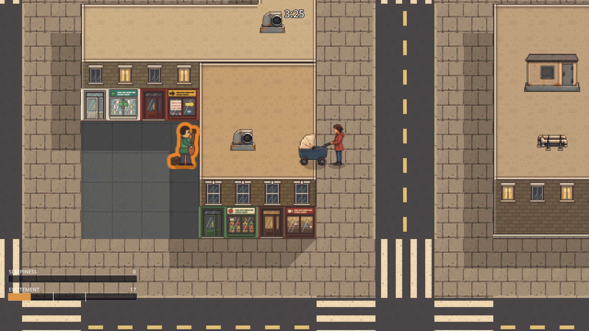
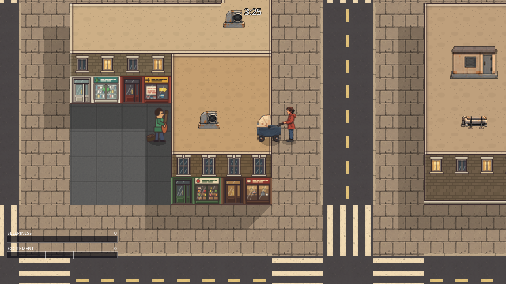

# Excitement stops at walls: the picture, the route costs and the frame cost

*(plaid-wombat, inbox #554: "Excitement should not go through any wall but it's not
straightforward. If the player is partially in a wall they should not be protected so the blocking
should happen in the middle of the wall (or one tile deep)".)* Three questions about the change
that makes every source's contribution zero once the line from it to her is
`Tuning.WALL_SHIELD_DEPTH` (half a tile, 16px) inside a building (`CityMap.wall_between()`): does
a source behind a building stop reaching her on screen, what does it do to the price of the
day's routes, and what does it cost a frame.

## The still pair

`wall-between.json` is a scene recipe: the recipe context city (`context_seed` 1917501), day 2, no
crowd, a street musician (`busker`, 19.3/s over a 45–190px field) on the square at (2992, 2608) and
her standing still at (3152, 2608), 160px east of him on the sidewalk beyond the four-tile building
between them. Both stills are its `playback.capture_at`, five seconds in, taken with
`tools/scene-recipes.sh --recipe wall-between.json --screenshots`.

Before (revision 03e96344): the musician wears an orange rim and the meter has reached 17.

After (revision d07de58b): no rim, and the meter is at 0.

## Route costs

`tests/probes/polite_rabbit_wall_costs.gd` (`tools/test.sh probes/polite_rabbit_wall_costs.gd`,
about seventeen minutes) builds each day the game builds — `City.start_day()`, then
`EventManager.start_day()` with the seals and the region's bodies — for seeds 4242, 90210 and 1337
on days 1, 5, 9 and 13, and walks every route of the day's `RouteTree` from the doorstep at
`Tuning.WALK_SPEED` with the events streamed and the crowd stepped around her. Each step prices
every source three ways: through walls, at the built 16px depth, and at a whole tile (32px), the
other reading of the player's sentence. Its own check holds that the 16px sum is what
`contribution_at()` charges. `route-costs.txt` is its output, at revision d07de58b.

| | Through walls | At 16px | At 32px |
|---|---:|---:|---:|
| Events, gross points over 184 routes (11,064s walked) | 22,867.2 | 22,441.9 (−1.9%) | 22,616.7 (−1.1%) |
| Crowd, the same walks | 17,760.9 | 17,760.9 | 17,760.9 |
| Events per minute walked | 124.0 | 121.7 | 122.6 |

The largest single day's drop is seed 4242's day 1, 1,305.8 to 1,238.2 points (−5.2%). Not one
crowd body was ever behind a wall on these walks: a walker's field reaches 30px, a car's 104px
abeam and at most twice that ahead, and a route runs down sidewalks whose buildings stand behind
her rather than between her and the carriageway. `docs/COSTS.md` prices a row met with nothing
between, so none of its rows move.

**Limits.** The events are not ticked: each is priced at its own live rate where it stands when
streamed in, so a mobile row is met where it starts and nothing pursues; the decay is left out
because it is the same either way. The route tree's cells are walked through the middle of their
walkable tiles, not along a lane.

## Frame cost

**What the wall test itself costs.** `count-walls.patch`, applied to revision d07de58b, counts every
`CityMap.wall_between()` call and its own time, printing the totals every 300 physics steps;
`wall-calls.txt` keeps the lines from a headless run of seed 4242 walking `3s8e4s8w` for 25s on
days 1 and 9. Between steps 300 and 900:

| Day | Calls a physics step | Calls a frame | Time a call | Time a frame |
|---:|---:|---:|---:|---:|
| 1 (234 crowd bodies) | 42 | 8.8 | 2.7µs | 23µs |
| 9 (50 crowd bodies) | 5.2 | 1.1 | 3.9µs | 4µs |

A headless run is not held to the display, so it draws about 4.8 frames a physics step rather than
two; the per-frame figure is the comparable one. The meter asks once a step for each source whose
field reaches her; the rest are the cue pass, the halo's pick and the caret's projection, which
asks at up to twenty projected places for every source whose field reaches one of them.

**What the whole frame does.** `timing.jsonl` holds every timing batch taken, in order, each line
naming its batch and revision. The frame-record lines are `analyse.py`'s summary of one headless
`--frame-record` run (seed 4242, `--walk 3s8e4s8w --after 25`, the first 150 physics steps left
out): the influence sweep per physics step (`Baby._physics_process()`, the meter's sum) and the
cue pass per frame (`ExcitementHalo._process()`, the halo's pick and the carets). The crowd-sweep
lines are `tests/probes/m159_contribution_cost.gd`'s median microseconds for one
`Crowd.excitement_sources_at()` over 180 sampled frames, three repetitions a run.

- **Batch 1** (base, a quiet machine): day 1 influence 248–254µs a step, cues 1,320–1,336µs a frame;
  crowd sweep 57.9µs on day 1, 10.7µs on day 9.
- **Batch 2** (the first commit, c8d81f85): day 1 influence 286–295µs, cues 1,470–1,502µs, about a
  sixth more; day 9 no higher.
- **Batch 3** (the line walk reading the tile grid directly rather than through three calls a
  tile, and a by-value answer for the present contribution): day 1 still 289–295µs and
  1,473–1,504µs. A change to the line walk that moved nothing pointed at the crowd instead:
  every body is asked `contribution_at()` every step and frame, and the first commit had split its
  field into a second function, a call more for all 234 of them.
- **Batch 4** (that field folded back into `contribution_at()`, d07de58b): taken while other
  agents' test runs had started loading the machine, so frame counts swing by half and the figures
  by a third run to run.
- **Batches 5 to 7** are therefore interleaved, before and after alternating, the same load on
  both: batches 5 and 6 by swapping the four source files between the two revisions in one
  checkout, batch 7 with `measure.sh` on two checkouts.

| Interleaved, batch 7 (`measure.sh`, 3 pairs) | Before 03e96344 | After d07de58b |
|---|---:|---:|
| Day 1 influence, µs a step (mean of runs) | 374 | 386 (+3%) |
| Day 1 cues, µs a frame | 2,115 | 2,158 (+2%) |
| Day 9 influence, µs a step | 300 | 323 (+8%) |
| Day 9 cues, µs a frame | 1,296 | 1,329 (+3%) |
| Day 1 crowd sweep, µs | 86.6 | 94.7 (+9%) |
| Day 9 crowd sweep, µs | 16.0 | 17.3 (+8%) |

Batch 6 (crowd sweep, 3 pairs) reads 87.7 to 92.4µs on day 1 (+5%) and 16.5 to 17.5µs on day 9
(+6%). The frame-record differences sit inside a run-to-run spread of up to a quarter, so they
bound the change rather than measure it: a few percent of the two buckets the wall test touches,
consistent with the 23µs a frame the counted calls take on day 1. Native desktop CPU only; nothing
here says what a phone pays.

## Rerunning

Everything runs from the repository root of a checkout of the revision named.

- The stills: `tools/scene-recipes.sh --recipe docs/evidence/polite-rabbit-walls-2026-10-04/wall-between.json --output <new dir> --screenshots`, once on each revision; needs a display.
- The route costs: `tools/test.sh probes/polite_rabbit_wall_costs.gd`.
- The wall-test count: `git apply docs/evidence/polite-rabbit-walls-2026-10-04/count-walls.patch`
  on a scratch checkout of d07de58b, `tools/check.sh`, then `<godot> --headless --path . -- --seed 4242 --day 1 --no-title --no-save --walk 3s8e4s8w --after 25` and the same with `--day 9`, reading the `ZZWALLS` lines.
- The interleaved timing: two clean checkouts, of 03e96344 and of d07de58b (fetch
  `refs/pull/<PR>/head` first once the branch is gone), then
  `docs/evidence/polite-rabbit-walls-2026-10-04/measure.sh --before <checkout> --after <checkout> --output <new dir> [--godot <path>]`; `analyse.py` beside it summarises any further record.
